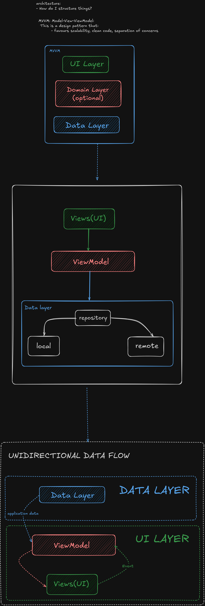

## Why Android needs architecture
- Activities are destroyed & recreated (rotation, low memory), we can not store data there
- We need **persistent data models** and a **Single Source of Truth (SSOT)**
- **Separation of concerns** makes the app testable, *scalable*, and robust

## The MVVM pattern (see diagram below)
- **View (UI)** – Activity/Fragment(in this scenario we are using composables). Sends user events(eg clicking buttons such as login button it will initiate  a login request from the user), observes state.
- **ViewModel** – Holds UI state, survives rotation, processes events, talks to repository
- **Data Layer** – Repository + local/remote sources(where does my data come from? if I downloaded images from the internet and are now for instance I want to send the smae image to my friend I basically retreive it from my own gallery- locally, 
however, in a case whereby I am streaming images from the net I getting the data from an external/ remote database) Single Source of Truth  for app data
**Data flows down, events flow up.**  
(More details in the diagram and code.)

