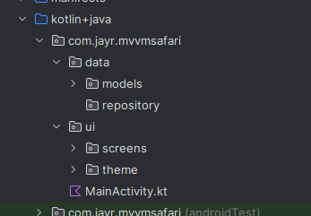
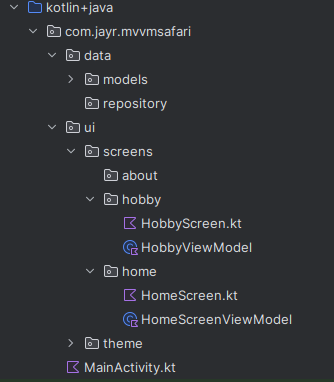

## Why Android needs architecture
- Activities are destroyed & recreated (rotation, low memory), we can not store data there
- We need **persistent data models** and a **Single Source of Truth (SSOT)**
- **Separation of concerns** makes the app testable, *scalable*, and robust


## A Visual Summary of MVVM Design Pattern
- 


## The MVVM pattern
- **View (UI)** – Activity/Fragment(in this scenario we are using composable). Sends user events(eg clicking buttons such as login button it will initiate  a login request from the user), observes state.
- **ViewModel** – Holds UI state, survives rotation, processes events, talks to repository
- **Data Layer** – Repository + local/remote sources(where does my data come from? if I downloaded images from the internet and are now for instance I want to send the smae image to my friend I basically retreive it from my own gallery- locally, 
however, in a case whereby I am streaming images from the net I getting the data from an external/ remote database) Single Source of Truth  for app data
**Data flows down, events flow up.**  
(More details in the diagram)

## Our Focus on this application:
- Create proper folder structure focusing on UI(Presentation layer), Data(Data layer) we will not focus on Domain layer at this stage nor dependency Injection.
- Steps: 
  - Create a package called *data* and inside it add two more packages *models* & *repositories* 
  - The presentation layer has already been added for you hence all you need to do is add the *screens* subfolder this will contain our respecting screens together with their respective ViewModels
    - You should have something like this:
        - 

    - Once the above has been achieved inside your screen each and ever screen you create will have the composable file and its respective viewmodel, kindly note that a composable is abut a kotlin function with a **@Composable** annotation and the viewmodel is a kotlin class that extends the **ViewModel()** class.
        - 

## Code Explanation: 

- ViewModel: 
  - A viewmodel basically stands between the data layer and presentation layer. 
  - It is a class that extends from the **ViewModel()**  class hence we will require the dependency:
    `implementation("androidx.lifecycle:lifecycle-viewmodel-compose:2.10.0")`
  - Now the ViewModel you have created will be broken down into two parts:
    - States => This is just but the data
    - Methods => Often the CRUD and other parts involving manipulating the data
```agsl
  
    class HobbyViewModel : ViewModel() {
    
          //    states
          private val _hobby = MutableStateFlow(HobbyModel())
          val hobby = _hobby.asStateFlow()
      
          //    methods => CRUD
          fun createHobby(name: String, description: String) {
              _hobby.value = HobbyModel(name= name, description = description)
        }
    }
```


### Relevant Resources:
- [Attain the ViewModel dependency](https://developer.android.com/develop/ui/compose/libraries)  
- [Understanding the purpose of the backing property](https://www.youtube.com/watch?t=1313&v=0FF19HJDqMo)

